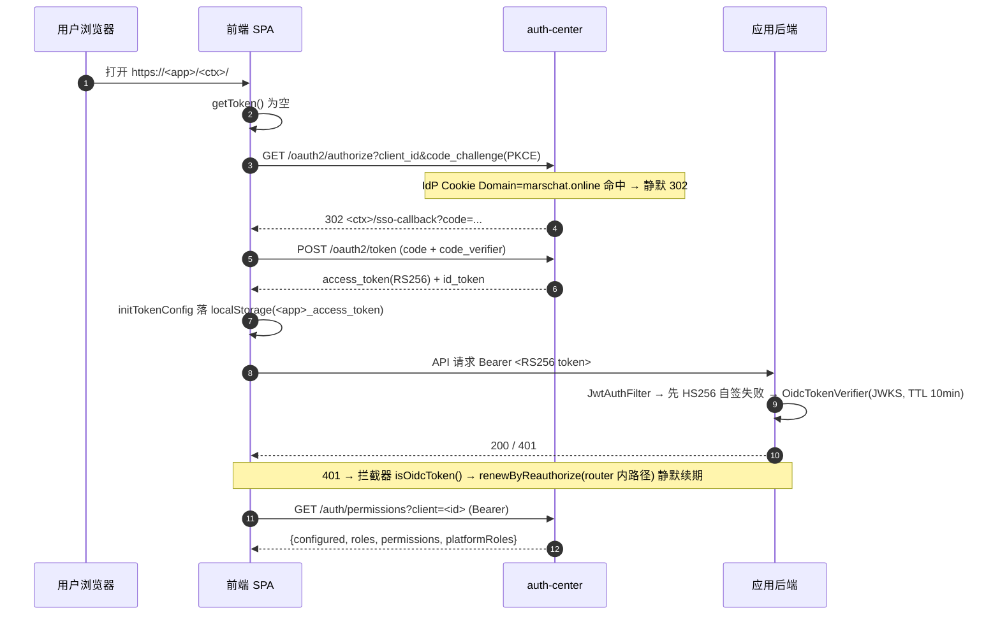
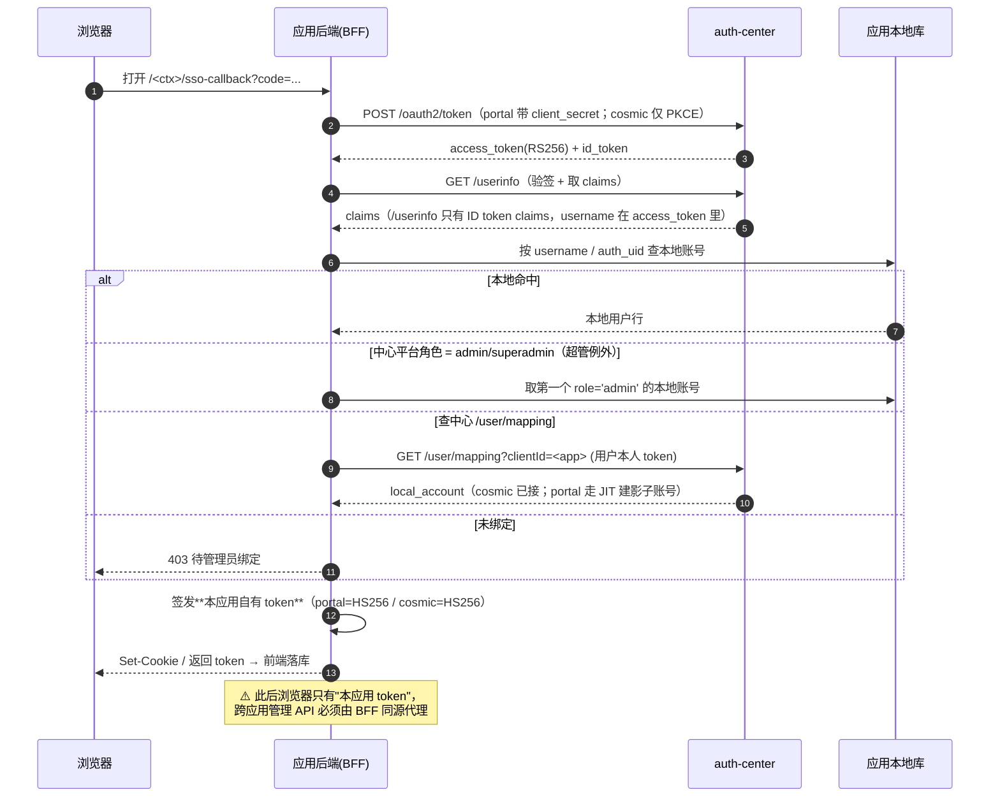
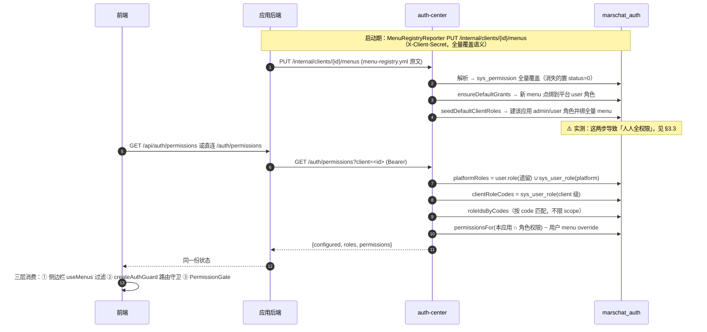
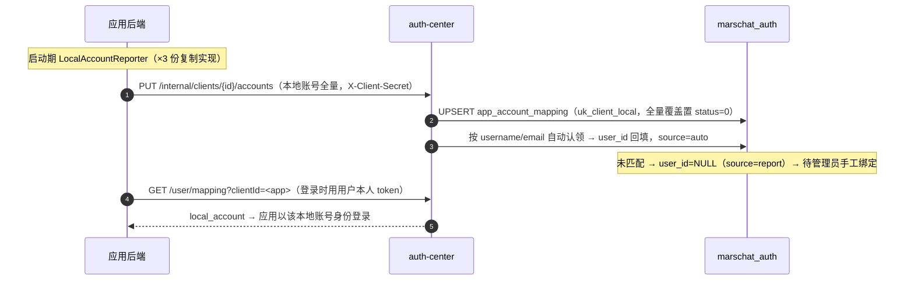
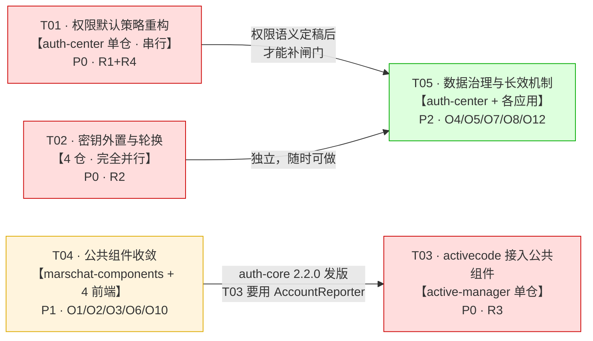

# 02 · 统一认证/鉴权/用户/权限 架构合理性评估与重构方案

> 评估人：高见远（架构师）｜评估日期：2026-09-15
> 评估方式：**只读对抗性复核**（不改任何业务仓库代码）。所有结论均附实测证据：文件:行号 / grep 命中数 / DB 实况 / 线上 HTTP 码。
> 判据：良哥的 4 条初衷（统一登录 / 统一鉴权 / 统一用户 / 统一权限+账号映射 + 应用也支持独立登录）。

---

## 0. 一句话结论

> **骨架是对的，血肉是空的。**
> 认证（Authentication）这一层做到了「统一且正确」——OIDC/RS256、四包公共组件、注册表驱动接入，方向没错，值得保留。
> **授权（Authorization）这一层实质失效**——实测 5 个应用的「普通用户角色」都拿到了该应用 **100% 的菜单权限点**，平台 user 角色还拿到了 `api:hosts:create`（写操作）。系统看起来在管权限，实际人人全权限，比不做更危险（管理员会误以为已经管控）。
> 同时存在 **4 项 P0**：默认全量授权、**HS256 共享密钥明文入库且跨应用互认**、activecode 完全没接入公共组件、双轨角色语义断裂。

---

## 1. 架构现状一张图

```mermaid
graph TB
    subgraph Browser["浏览器（marschat.online 域）"]
        B1["portal SPA<br/>main.marschat.online/portal/"]
        B2["kb-web SPA<br/>kb.marschat.online/kb/"]
        B3["kb-ops SPA<br/>kb.marschat.online/ops/"]
        B4["infra SPA<br/>monitor.marschat.online/infra/"]
        B5["cosmic Vue3<br/>cosmic.marschat.online/"]
        B6["activecode 静态页<br/>tools.marschat.online/activecode/"]
    end

    subgraph Components["marschat-components（公共组件四包）"]
        C1["@marschat/auth-components 0.8.4/0.8.5<br/>LoginPanel / SsoCallback / usePermissions / useMenus<br/>+ UMD 单文件"]
        C2["@marschat/frontend-common 0.3.5<br/>createRequest / createAuthGuard / tokenStore"]
        C3["com.marschat:auth-core 2.1.6<br/>TokenProvider / OidcTokenVerifier / @RequirePermission<br/>MenuRegistryReporter / Feign 透传"]
        C4["com.marschat:common-core 1.1.4 / 1.1.6<br/>Result / 异常 / MP 配置"]
    end

    subgraph IdP["auth-center（枢纽 · 下游 12 应用，OIDC 已注册 10 client）"]
        A1["Spring Authorization Server<br/>OIDC + RS256 + JWKS"]
        A2["clients.yml（classpath 派生 · 重启才生效）<br/>10 个 client（含 p3-probe-client 测试残留）"]
        A3["/auth/permissions<br/>权限下发"]
        A4["/internal/clients/{id}/menus<br/>菜单上报（X-Client-Secret）"]
        A5["/internal/clients/{id}/accounts<br/>账号映射上报"]
        A6["/user/mapping<br/>自助查映射"]
    end

    DB[("MySQL 192.168.31.105<br/>marschat_auth<br/>user / sys_role / sys_permission<br/>sys_role_permission / sys_user_role<br/>sys_app_client / app_account_mapping")]

    subgraph Backends["各应用后端（鉴权形态不一）"]
        E1["portal-server<br/>JwtInterceptor(HS256) + JwtUtil<br/>+ PortalPermissionChecker<br/>@RequirePermission × 1 · fail-open=false"]
        E2["kb-gateway(WebFlux)<br/>JwtAuthFilter + OidcTokenVerifier<br/>@RequirePermission × 0"]
        E3["kb-ops-server<br/>JwtAuthenticationFilter<br/>@RequirePermission × 14 · fail-open=true"]
        E4["infra-monitor-server<br/>JwtAuthFilter + JwtUtil(HS256)<br/>+ 配置式 admin/<REDACTED-PWD><br/>@RequirePermission × 0"]
        E5["cosmic FastAPI<br/>current_user(本地 users 表)<br/>+ authz.py 复刻 PermissionChecker<br/>require_permission × ~8"]
        E6["activation-code-server<br/>AuthInterceptor + 自抄 OidcTokenVerifier(144行)<br/>本地 admin_user 表 · 无公共组件"]
    end

    subgraph LocalAcct["应用本地账号库（第二真源）"]
        L1["tools.sys_user × 13"]
        L2["cosmic_studio.users × 2"]
        L3["tools.admin_user × 1"]
        L4["infra 配置式 admin/<REDACTED-PWD>"]
    end

    B1 --> C1 & C2
    B2 & B3 & B4 --> C1 & C2
    B5 --> C1 & C2
    B6 --> C1

    B1 & B2 & B3 & B4 & B5 & B6 -- "OIDC authorize(PKCE/secret)" --> A1
    A1 -- "IdP Cookie Domain=marschat.online" --> B1 & B2 & B3 & B4 & B5 & B6

    B2 & B3 & B4 -- "浏览器直换 code→token" --> A1
    B1 -- "BFF 机密客户端 服务端换票" --> E1
    B5 -- "BFF public PKCE 服务端换票" --> E5
    B6 -- "静态页 UMD 前端直换" --> A1

    E1 & E3 & E4 --> C3
    E2 --> C3
    E1 & E2 & E3 & E4 --> C4
    E6 -.->|"❌ 未接入任何公共组件"| C3

    E1 & E2 & E3 & E4 & E5 & E6 -- "Bearer 校验" --> A1
    E1 & E3 & E5 -- "GET /auth/permissions" --> A3
    E1 & E2 & E3 & E4 -- "PUT /internal/.../menus" --> A4
    E1 & E4 & E6 -- "PUT /internal/.../accounts" --> A5
    E5 -- "GET /user/mapping" --> A6

    A1 & A3 & A4 & A5 & A6 --> DB
    E1 --> L1
    E5 --> L2
    E6 --> L3
    E4 --> L4

    style E6 fill:#ffdddd,stroke:#cc0000
    style C3 fill:#ddffdd,stroke:#00aa00
    style DB fill:#eeeeff,stroke:#6666cc
```



### 1.1 关键链路时序

#### (1) SSO 登录（浏览器直换 PKCE —— kb-web / kb-ops / infra 主流形态）



#### (2) BFF 服务端换票（portal 机密客户端 / cosmic public PKCE）



#### (3) 权限下发与三层同源



#### (4) 账号映射



---

## 2. 五个核心问题的逐条回答

### 2.1 【问题 1】接入形态是否统一、是否真的「配置即接入」

#### 结论：**换票形态的多样性 80% 是必要的；但「配置化」只在 2/4 前端真正落地，且新接入要重启枢纽。**

#### 证据 1：三种换票形态的必要性逐项判定

| 形态 | 应用 | 技术必要性 | 判定 |
|---|---|---|---|
| BFF 机密客户端（服务端换票，client_secret） | portal | 必须代理平台级管理 API（`/admin/users` 等）—— 浏览器只有自家 HS256 token，跨域直连 auth-center 必 401。`portal/src/utils/permissions.ts:16` 注释原文：*"直连 `https://auth.marschat.online/auth/permissions` 必然 401"* | ✅ 必要 |
| BFF public PKCE（Python 服务端换票） | cosmic | 有本地 `users` 表，必须在服务端把中心身份映射成本地账号后才能签发自家 token（`app/routers/auth.py:156 _resolve_local_user`） | ✅ 必要 |
| 浏览器直换 PKCE | kb-web / kb-ops / infra | 纯 SPA，无本地账号库，账密/邮箱码都直连 auth-center 业务 API（`/kb/api/auth/login` 经网关白名单） | ✅ 必要（最简形态） |
| 静态页内嵌 UMD | activecode | **非必要**。active-manager 本身就是 Spring Boot 应用（`activation-code-server`），完全可以走 BFF 或做成 SPA。「无构建链」是当初没投入，不是技术必然 | ❌ **历史欠债** |

#### 证据 2：「配置即接入」只有一半落地（实测）

| 前端 | `public/app-config.json` | `src/config.ts` | `sso.ts` 是否消费运行时配置 | 线上 HTTP |
|---|---|---|---|---|
| kb-web | ✅ | ✅ | ✅ `OIDC_ISSUER/OIDC_CLIENT_ID/OIDC_REDIRECT_URI` from `@/config` | `GET /kb/app-config.json` → **200** |
| infra-monitor | ✅ | ✅ | ✅ 同上 | `GET /infra/app-config.json` → **200** |
| kb-ops | ✅ | ✅ | ❌ **硬编码**：`kb-ops-web/src/utils/sso.ts:30-31` `issuer:'https://auth.marschat.online'`, `clientId:'marschat-kbops'` | `GET /ops/app-config.json` → **200**（但没人读） |
| portal | ❌ **不存在** | ❌ **不存在** | ❌ **硬编码**：`portal/src/utils/sso.ts:30-31` | `GET /portal/app-config.json` → 返回 **index.html**（SPA fallback） |
| activecode | ❌ | ❌ | 硬编码在 `login.html` | — |

> **这就是 ADR 说「已闭环」与实况的差距**：`app-config.json` 生成了、部署了、线上 200，但 **kb-ops 的代码根本没读它**。文档口径是「配置化接入」，代码口径是「一半配置化、一半硬编码」。

#### 证据 3：新接入第 7 个应用 —— 接入触点清单（实测）

**要不要改 auth-center Java？** → **不用**（`ClientsYmlLoader` 是 `ApplicationRunner`，读 classpath `clients.yml`）。
**要不要改公共组件？** → **不用**（菜单/权限/SSO 能力都已封装）。
**但要改 auth-center 的资源文件并重启枢纽** —— 这是文档没明说的隐藏代价。

| # | 触点 | 仓 | 文件 | 是否必须 | 代价 |
|---|---|---|---|---|---|
| 1 | 注册应用 | devtools | `apps-registry.yml`（+1 段约 20 行） | 必须 | 低 |
| 2 | 生成 OIDC 客户端种子 | auth-center | `src/main/resources/clients.yml`（AUTO-GENERATED） | 必须 | **中：需跑 auth-center 流水线并重启枢纽** |
| 3 | 生成运行时配置 | 新前端 | `public/app-config.json`（AUTO-GENERATED） | 必须（若走配置化） | 低 |
| 4 | 前端薄适配 | 新前端 | `src/config.ts` / `utils/token.ts` / `utils/sso.ts` / `utils/request.ts` | 必须 | **中：4 文件约 300 行，靠抄 infra** |
| 5 | 前端页面 | 新前端 | `views/login/LoginView.vue` / `views/sso/SsoCallbackView.vue` | 必须 | 低 |
| 6 | 前端挂载 | 新前端 | `main.ts`（`window.__MARSCHAT_APP_BASE__` + `setupAuthGuard` 顺序） | 必须 | 低（顺序错了静默失效） |
| 7 | 后端依赖 | 新后端 | `pom.xml` +auth-core 2.1.6 | 必须 | 低 |
| 8 | 后端配置 | 新后端 | `application.yml`（`marschat.oidc.*` / `marschat.menu.report.*` / `marschat.authz.*`） | 必须 | 低 |
| 9 | 后端代码 | 新后端 | `OidcConfig.java` / `JwtUtil.java` / `SecurityConfig.java`（**必须显式 401 entry point**） | 必须 | 中（约 120 行，靠抄 infra） |
| 10 | 菜单注册 | 新后端 | `resources/menu-registry.yml` | 可选（要权限就必须） | 低 |
| 11 | 容器密钥 | 部署 | `MARSCHAT_MENU_REPORT_SECRET` env | 必须 | 低 |
| 12 | 本地账号上报 | 新后端 | `LocalAccountReporter.java` | 可选（有本地账号库就要） | **中：auth-core 里没有公共实现，必须自己抄一份（现 3 份复制）** |

**实测结论**：**12 个触点，其中 4 个（#4/#9/#12）是「抄代码」而不是「做配置」**。
`#12 LocalAccountReporter` 尤其打脸「配置即接入」——它连公共实现都没有：

```
portal-server/.../LocalAccountReporter.java        111 行
infra-monitor-server/.../LocalAccountReporter.java  95 行
activation-code-server/.../LocalAccountReporter.java 104 行
diff portal vs infra  → 64 行差异（约 60% 相同，典型复制粘贴）
```

**判定**：`配置即接入` **部分成立**。OIDC 客户端注册这一段真的做到了（改 yml + 跑生成器）；但**应用侧的 300 行薄适配层 + 120 行后端三件套 + 100 行账号上报器仍然靠「照抄 infra-monitor」**，且**每次接入都要重启 auth-center 枢纽**。

---

### 2.2 【问题 2】有没有「每个应用各写一份」的复制粘贴

#### 结论：**有，且量不小 —— 约 1400 行同构代码存在于 4~6 份副本中。ADR 记录了「已删 3 份 OidcTokenVerifier 副本」，但收敛只做了一半。**

#### 证据：重复实现 × N 份清单

| 重复实现 | 份数 | 位置（文件:行号 / 行数） | 同构度 | 是否值得收敛 |
|---|---|---|---|---|
| `utils/sso.ts`（SSO client 薄适配） | **4** | kb-web 130 / kb-ops 128 / portal 118 / infra 126 | diff(kb-ops,infra) 仅 18 行差异（≈86% 相同） | ✅ **值得**（组件应提供 `createAppAuth(config)` 一站式） |
| `utils/permissions.ts`（权限状态 + 守卫装配） | **4** | kb-web 92 / kb-ops 91 / portal 92 / infra 93 | ≈95% 相同 | ✅ **值得** |
| `utils/token.ts`（initTokenConfig 适配） | **3** | kb-web 36 / kb-ops 37 / infra 36 | ≈97% 相同 | ✅ **值得** |
| `menus.ts`（菜单硬编码） | **3** | kb-web 93 / kb-ops 48 / infra 17 | 内容不同（各自菜单） | ⚠️ 见下（刻意双真源） |
| `menu-registry.yml` | **4** | infra / kb-ops / kb-gateway / portal `resources/` | 各应用自有 | ✅ 合理（但需与 menus.ts 同步） |
| `JwtUtil`（HS256 自签 + RS256 回退） | **2** | portal 94 行 / infra 78 行 | 中（portal 用 hutool，infra 用 jjwt） | ⚠️ 中（portal 是 BFF 需自签，可接受） |
| `OidcTokenVerifier` 副本 | **1 残留** | `activation-code-server/.../util/OidcTokenVerifier.java` **144 行**（auth-core 版 158 行） | 高（JWKS TTL 10min + kid 回退逻辑同构） | ❌ **不该存在**（ADR 记载 kb-gateway/kb-ops/infra 三份已删，唯独漏了 activecode） |
| `LocalAccountReporter`（账号上报） | **3** | portal 111 / infra 95 / activecode 104 | diff 64 行（≈60% 相同） | ✅ **值得**（应进 auth-core） |
| JWT 认证 Filter/Interceptor | **4** | kb-ops `security/JwtAuthenticationFilter` / infra `filter/JwtAuthFilter` / kb-gateway `filter/JwtAuthFilter`(WebFlux) / myfrp `security/JwtAuthenticationFilter` | 中（Servlet vs WebFlux 不可合并） | ⚠️ 部分（Servlet 版可收敛进 auth-core） |
| `PermissionChecker` | **3 套** | auth-core Java 版 / `PortalPermissionChecker`(portal 自建) / `app/authz.py`(cosmic Python 复刻 117 行) | 语义同构（configured / platformRole 恒放行 / qualify） | ⚠️ 中（Python 版受语言边界限制，Portal 版应复用） |
| `createAuthGuard`/`setupAuthGuard` 装配 | **4** | 各前端 `utils/permissions.ts` | ≈95% | ✅ **值得** |

**合计**：约 **1400 行**同构代码分布在 4~6 份副本中；其中 **sso.ts + permissions.ts + token.ts 三项 ≈ 1000 行 × 4 前端** 是最大块，且 `INTEGRATION-GUIDE.md §3.1` 明确写的是「**照抄 infra-monitor-web 的薄适配层**」——指南本身就把复制粘贴固化成了标准做法。

**判定**：
- **值得收敛（高收益）**：前端薄适配层 4 件套（→ 组件出一站式工厂）、`LocalAccountReporter`（→ auth-core）、activecode 的 `OidcTokenVerifier` 副本（→ 删，引 auth-core）。
- **不值得收敛（附理由，避免下次重复论证）**：
  - myfrp 的 `JwtAuthenticationFilter`：myfrp 不在六应用紧密接入范围，且它是独立 Spring Boot 应用，收敛收益低。
  - kb-gateway 的 WebFlux 版 `JwtAuthFilter`：技术栈不同（WebFlux vs Servlet），物理无法合并。
  - cosmic 的 `authz.py`：Python 无法引 Java 组件，只能靠契约测试防漂移（见 §4 O5）。

---

### 2.3 【问题 3】数据模型是否合理

> 库：`marschat_auth`（MySQL 192.168.31.105）。20 张表。以下全部为**实测**（2026-09-15）。

#### 证据：表实况

| 表 | 行数 | 判定 |
|---|---|---|
| `user` | 39（**仅 2 行 deleted=0**：admin / probeuser） | 正常（37 行是历史测试软删账号） |
| `user_identity` | **2** | ⚠️ **准死表**：只有 DatabaseInitializer 的存量迁移写入，无业务读写 |
| `sys_role` | 17（2 platform + 15 client） | 正常 |
| `sys_permission` | 51（47 menu + 4 api） | 正常 |
| `sys_role_permission` | 133 | ⚠️ 异常分布，见下 |
| `sys_user_role` | **16**（只有 3 个用户有绑定） | 正常但覆盖窄 |
| `sys_user_menu_override` | **0** | ⚠️ 功能已建未用（R9 用户级菜单减法） |
| `sys_role_composite` | **0** | ❌ **死表**（角色继承从未实现；`expandComposites` 代码在跑但永远查不到） |
| `sys_app_client` | 10（menu_registry_json 存菜单树原文） | 正常 |
| `app_account_mapping` | 12（**8 行 user_id=NULL**） | ⚠️ 覆盖率低，见下 |
| `oauth2_registered_client` | 10 | 正常（含 `p3-probe-client` 测试残留） |
| `kb_auth` 库（旧） | 13 表，**最后写入 2026-09-12 08:44** | ⚠️ 已停用但仍在实例上，含 21 行 user（含密码哈希） |

#### ① 权限点编码与作用域（platform vs client）

- **编码**：`sys_permission` 存 `client_id + type + code`（如 `marschat-kbops` / `menu` / `hosts`），下发时拼成 `marschat-kbops:menu:hosts`。**设计合理，UNIQUE(client_id, type, code) 到位**。
- **作用域**：❌ **platform 级权限点不存在** —— 51 个权限点**全部**有 client_id。跨应用的平台级权限（如「统一认证中心管理台」）只能硬塞进 `marschat-portal:api:admin`（见 `portal menu-registry.yml` 第 25-30 行注释，作者自己承认这是权宜）。
  → **影响**：无法表达「某人在所有应用都是管理员」这类跨应用权限，只能靠 `user.role='admin'` 遗留字段隐式实现。

#### ② 角色两套体系会不会打架 —— **会，而且是实锤的语义断裂**

```sql
-- 实测：user.role 值域 vs sys_role.code 值域
user.role (admin) = 'superadmin'          -- 但 sys_role 里根本没有 code='superadmin' 的行！
sys_role codes  = admin / user / ops-viewer / g3-adm2 / g3-adm5
```

三段硬证据：

1. **`superadmin` 是「幽灵角色」**：`PermissionService.platformRoles()`（`:93`）把遗留 `user.role` 直接并入角色集；但 `roleIdsByCodes()`（`:121-138`）按 `code IN (...)` 查 `sys_role`，**`superadmin` 查不到任何 role_id** → 超管的"超级"语义在 RBAC 层完全不生效。
   它只在**代码硬编码字符串**里存在：
   - `auth-core/PermissionChecker.java:74` `if ("admin".equals(role) || "superadmin".equals(role)) return true;`
   - `cosmic/app/authz.py:89` `if r in ("admin", "superadmin")`
   - `cosmic/app/routers/auth.py:91` `PLATFORM_ADMIN_ROLES = {"superadmin", "admin"}`
   → **管理员在中心授权界面无法授予任何人 superadmin**，只能直接改数据库 `user.role` 字段。

2. **遗留 `user.role` 是绕过 RBAC 的隐形提权通道**：
   `roleIdsByCodes` 的 WHERE 是 `r.code IN (...) AND (r.scope='platform' OR (r.scope='client' AND r.client_id=?))`。
   → 一个 `user.role='admin'` 的用户，**自动获得 `platform/admin` + 该应用 `client/admin` 的权限**，且**在 `sys_user_role` 里完全看不到这条授权**。改一个字段 = 全域提权，审计日志里查不到。

3. **实测未爆炸只是因为人少**：全库活跃用户只有 2 个（admin / probeuser），两人都有 RBAC 绑定。一旦开始批量开账号，风险立即兑现。

#### ③ 账号映射表能否支撑「一个中心账号 ↔ 多应用本地账号」和反向查询

**结构**：✅ 能。
- `UNIQUE(client_id, local_account)` → 一个中心账号可映射多应用本地账号（正向）；
- `INDEX idx_mapping_user(user_id)` → 反向查询（中心账号 → 各应用账号）索引到位；
- `source`（report/auto/manual）+ `status` + `linked_at` 语义完整。

**数据**：❌ **基本没用起来**。

| client | 本地账号数 | 中心有效映射 | 其中已认领(user_id 非空) | 判定 |
|---|---|---|---|---|
| marschat-portal | `tools.sys_user` = **13** | 7 | **1**（admin） | ❌ 6 个本地账号未认领 |
| cosmic-studio | `cosmic_studio.users` = **2** | 2 | 1（admin） | ⚠️ `qa_ed_93cca4` 未认领 |
| marschat-activecode | `tools.admin_user` = 1 | 1 | 1 | ✅ |
| marschat-inframon | 配置式（1） | 1 | 1 | ✅ |
| marschat-kbops / kbweb | 无本地账号库 | 0 | — | ✅ 纯中心账号，不需要映射 |

- 总 12 行，**8 行 `user_id=NULL`（未认领）**、1 行 `status=0`（失效）。
- **反向查询接口 `/user/mapping` 只有 cosmic 在用**（`routers/auth.py:127`），portal 走的是 JIT 建影子账号，没查中心映射。

#### ④ 死表 / 冗余表

| 对象 | 实况 | 建议 |
|---|---|---|
| `sys_role_composite` | 0 行，`expandComposites` 每次查询都白跑一次 | **删除表 + 删除展开代码**（角色继承从未实现） |
| `sys_user_menu_override` | 0 行（R9 用户级菜单减法已上线但零使用） | 保留表，但**要么补数据验证功能，要么在文档标注"未验证"** |
| `user_identity` | 2 行，仅启动迁移写入，无业务读写；`UNIQUE(provider,identifier)` 从没被业务消费 | **标注为准死表**（不要删，email 唯一性后续可能要用；但别再宣称它是"唯一性事实"） |
| `kb_auth` 库 | 13 表，最后写入 2026-09-12 08:44，含 21 行 user（含 bcrypt 密码） | **归档脱敏后 DROP**（不是紧急项，但是合规隐患） |
| `p3-probe-client` | Phase3 验收用的探针 client，仍在生产 `oauth2_registered_client` | **删除** |
| `sys_error_log` | 被当页面访问日志用（实测最近 15 条全是 `[info] frontend 页面访问: /xxx`） | 语义污染，建议前端埋点走独立通道 |

#### 补充：**`menu_registry` 表不存在**
任务书里提到的 `menu_registry` 表，实际是 `sys_app_client.menu_registry_json`（MEDIUMTEXT 列，存 yml 原文）。实测：5 个应用已上报（portal 2777 字符 / kb-ops 2232 / kb-web 1890 / infra 1246 / cosmic 690），最新上报 2026-09-14。

---

### 2.4 【问题 4】鉴权是否真的统一

#### 结论：**认证层基本统一（5/6 用了公共组件或同构实现），授权层支离破碎（17 处闸门集中在 1 个应用）。**

#### 证据 1：后端接口级鉴权覆盖矩阵（grep 实测）

| 应用 | `@RequirePermission` 命中数 | authz 配置 | fail-open | 认证层实现 | 是否用公共组件 |
|---|---|---|---|---|---|
| portal-server | **1**（`SsoController.java:233 api:admin`） | `marschat.authz.client-id=marschat-portal` | **false**（显式）✅ | `JwtInterceptor` + 自建 `JwtUtil`(HS256) + `PortalPermissionChecker` | 部分（auth-core 仅用于菜单上报+authz） |
| kb-ops-server | **14**（11 menu + 3 api） | `client-id=marschat-kbops` | **true**（默认）⚠️ | `security/JwtAuthenticationFilter`（自建） | ✅ auth-core 2.1.6 |
| infra-monitor-server | **0** | 未配 | — | `filter/JwtAuthFilter` + `JwtUtil`(HS256) + 配置式 admin | 部分（仅 OidcTokenVerifier + 菜单上报） |
| mykng（kb-gateway / kb-server / kb-intelligence） | **0** | 未配 | — | kb-gateway `JwtAuthFilter`(WebFlux) | 部分（OidcTokenVerifier） |
| activation-code-server（activecode） | **0** | — | — | `AuthInterceptor` + **自抄 OidcTokenVerifier** | ❌ **完全没有** |
| cosmic-studio（Python） | **~8** 处 `require_permission` | `OIDC_CLIENT_ID` env | **fail-open**（`verdict is None → 放行`）⚠️ | 本地 `users` 表 + `current_user` | ❌ 无（Python 复刻 `authz.py`） |

> **17 处接口闸门里 14 处在 kb-ops 一个应用**。infra / kb-web / kb-gateway / activecode 的接口级鉴权**为零**——只有"认证"，没有"授权"。

#### 证据 2：Java 侧与 Python 侧是否同构

| 语义 | auth-core `PermissionChecker` | cosmic `authz.py` | 是否一致 |
|---|---|---|---|
| 拉取失败 | `return failOpen`（默认 true） | `return None` → 放行 | ✅ 一致（都 fail-open） |
| `configured=false` | `return true` | `return True` | ✅ 一致 |
| 平台 admin/superadmin 恒放行 | `PermissionChecker.java:74` 硬编码 | `authz.py:89` 硬编码 | ✅ 一致（但两边各硬编码一份，是漂移源） |
| 权限码补全 `qualify` | 不以 client 前缀开头则补 | 同 | ✅ 一致 |
| 缓存 | 60s，按 (token) 分桶 | 60s，按 (uid, access_token) 分桶 | ⚠️ 略有差异（cosmic 多 uid 维度） |
| 用户级菜单减法 | `permissions.removeAll(denied)` | ❌ **未实现** | ❌ **不同构**（cosmic 的菜单减法只对前端生效，后端拦不住） |

#### 证据 3：fail-open 策略是否安全

- `AuthzAutoConfig` 默认 `failOpen = true`（`AuthzAutoConfig.java:66`）。
- 只有 **portal 显式配了 `fail-open: false`**（`portal/application.yml:69`），因为它是管理面。
- **kb-ops 有 14 处闸门（含 3 个写操作 `api:hosts:create/update/delete`）却用默认 fail-open** → auth-center 抖动期间，任何人都能建/改/删主机。
- cosmic 同样是 fail-open（降级为本地角色门槛）。

**判定**：fail-open 作为**可用性兜底**本身是合理设计（枢纽抖动不打死整站），但**必须按接口分级**：
- 读接口：fail-open ✅
- 写接口 / 管理面：**必须 fail-closed** ❌ 当前只有 portal 做到。

---

### 2.5 【问题 5】「统一」与「独立登录」是否矛盾

#### 结论：**4/6 应用是「应用自建账号库」形态，且其中 3 个的本地账号没有真正映射到中心 —— 初衷「应用也支持独立登录」允许保留本地账号库，但「用户统一管理」要求这些账号必须映射到中心，这条没做到。**

#### 证据：各应用登录形态实测

| 应用 | 独立登录实现 | 账号存在哪 | 是否映射到中心 | 判定 |
|---|---|---|---|---|
| portal | `POST /portal/api/auth/login` → `sys_user` + BCrypt（`AuthController.java:29-52`） | `tools.sys_user` **13 行** | 7 条映射，**6 条未认领** | ⚠️ 本地影子账号未回收 |
| activecode | `POST /activecode/api/auth/login` → `admin_user`（salt+hash） | `tools.admin_user` **1 行** | 1 条，已认领 | ✅ |
| cosmic | `POST /api/auth/login` → `users` + verify_password | `cosmic_studio.users` **2 行** | 2 条，`qa_ed_93cca4` 未认领 | ⚠️ |
| infra | 配置式应急管理员（`infra.admin.username/password`，默认 admin/<REDACTED-PWD>） | **配置文件 env** | 1 条（admin） | ⚠️ 弱口令默认值 + 账号不在任何库 |
| kb-ops | 无本地登录（注释：*"kb-ops 后端无本地登录端点，纯 SSO 应用隐藏账密死表单"* `LoginView.vue:33`） | — | — | ✅ 纯中心 |
| kb-web | 账密/邮箱码**直连 auth-center**（`/kb/api/auth/login`） | — | — | ✅ 纯中心 |

**关键判据**：
- 良哥初衷明确说「应用**也支持**独立登录」→ **保留本地账号库本身不违规**。
- 但「用户统一管理」要求：本地账号必须登记到中心并可被反向查询。实测 **portal 13 个本地账号只有 1 个被认领**，`app_account_mapping` 12 行中 8 行 `user_id=NULL`。
- 更严重的是 **portal 的 JIT 影子账号**：SSO 登录时自动在 `sys_user` 建行（`SsoController.java:154` `sysUserMapper.insert`），实测造出 `p9ga`/`p9ga2`/`p9ga3`/`p9g4w`/`p9mapw`/`253`/`p9g3u` 等一批测试残留账号——**中心删了用户，portal 的影子账号不会被清理**（无回收机制）。

#### 登录最低线（账密 + 邮箱验证码 + 忘记密码）实测

| 应用 | 账密 | 邮箱验证码 | 忘记密码 | 证据 |
|---|---|---|---|---|
| portal | ✅ | ✅ | ✅ | 三个关键词均在 `portal/src/views/LoginView.vue` 命中 |
| kb-web | ✅ | ✅ | ✅ | `kb-web/src/views/login/LoginView.vue` |
| kb-ops | ⚠️（账密被后端否决，仅保留邮箱码+SSO） | ✅ | ✅ | `LoginView.vue:33` 注释 |
| infra | ✅（配置式） | ✅ | ✅ | `AuthController.java:31-34` 注释 |
| cosmic | ✅（本地） | ✅（BFF 换票） | ✅ | `Login.vue:36` 注释 |
| **activecode** | ✅（本地 admin_user） | ❌ **无** | ❌ **无** | `login.html`（214 行）grep `mail`/`忘记`/`forgot` **零命中**；只有 `handleLogin` + `startSsoLogin` |

> **activecode 不满足登录最低线**。

#### 超管邮箱
✅ 实测 `marschat_auth.user` id=1：`username=admin, email=marschat@163.com, role=superadmin, deleted=0` —— 符合要求。

---

## 3. 分级结论表

### 3.1 🔴 必须重构（4 项）

| # | 问题 | 影响 | 改动面（仓 / 文件） | 爆炸半径 | 代价 |
|---|---|---|---|---|---|
| **R1** | **默认授权种子 = 全量放行**：`ensureDefaultGrants` 把新 menu 权限点全绑到平台 `user` 角色；`seedDefaultClientRoles` 把应用全部 menu 点绑到应用 `user` 角色。实测 **5/5 应用 `client/user` 拿到 100% menu 点（8/8、6/6、16/16、15/15、2/2）**；平台 `user` 拿到 36/51，**含 `marschat-kbops:api:hosts:create`（写操作）**；`cosmic-studio:menu:admin` 也发给了普通用户 | ① 良哥初衷「权限统一管理」实质落空；② 管理员误以为已管控，实际人人全权限；③ 普通用户可创建主机（写越权）；④ 比不做更危险 | auth-center：`PermissionService.java:643 ensureDefaultGrants` / `:757 seedDefaultClientRolesFor` / `:666 syncDefaultGrantsForAllClients`；`DatabaseInitializer.java:330-334` 调用点；+ 一次性数据修复 SQL | **中**：只改 auth-center 一仓，但影响 6 应用的菜单可见性与 17 处接口闸门。**需灰度**：先摘掉 api 点，再动 menu 点 | 中（2~3 天）：改代码 0.5 天 + 数据修复 0.5 天 + 6 应用回归 1~2 天 |
| **R2** | **HS256 共享密钥明文入库 + 跨应用 token 互认**：`infra-monitor-server/docker-compose.yml:24` `JWT_SECRET=<REDACTED-JWT-SECRET>` **与 `portal/portal-server/.../JwtUtil.java:19` 的 Java 默认密钥完全相同**；`infra-monitor-server/docker-compose.yml:27` `INFRA_ADMIN_PASS=<REDACTED-PWD>`；`mykng/.env:25` JWT_SECRET 明文；`apps-registry.yml:24` `<REDACTED-CLIENT-SECRET>` 默认 OIDC client secret | ① 任一拿到 git 仓库的人可伪造 portal/infra 的任意用户 token（含 role=admin）；② infra 的 token 能通过 portal 的 `JwtInterceptor`（只验签名不验 role 白名单，`JwtInterceptor.java:25-33`）；③ 弱口令 <REDACTED-PWD> 可直登 infra | 4 仓**各自独立**：infra `docker-compose.yml` + `application.yml`；portal `JwtUtil.java:19` + `application.yml`；mykng `.env` + `docker/docker-compose.app.yml`；devtools `apps-registry.yml:24` | **小**：4 仓互不依赖，可完全并行；但**必须一次性轮换**（只改一处等于没改） | 低（1 天）：生成新密钥 + 改 6 个文件 + 各应用滚动重启（有短暂登录态失效，需公告） |
| **R3** | **activecode 完全没接入公共组件**：无 auth-core / common-core 依赖；自抄 `OidcTokenVerifier` 144 行；本地 `admin_user` 账号库；登录页**缺邮箱验证码 + 缺忘记密码**；账号上报虽实现但 `sys_app_client.last_sync_at=NULL`（**从未成功上报**） | ① 违反初衷 1/2（接入=接组件+做配置）；② 违反登录最低线；③ 验签逻辑与其余 5 应用不同源，改一处忘一处 | active-manager 仓：`pom.xml` +auth-core 2.1.6；删 `util/OidcTokenVerifier.java`；`config/AuthInterceptor.java` 改引 `com.marschat.auth.oidc`；`resources/static/activecode/login.html` 补邮箱码+忘记密码（或换用 LoginPanel 组件）；`application.yml` 补 `marschat.oidc.*` / `marschat.account.report.*`；docker-compose 补 `MARSCHAT_MENU_REPORT_SECRET` | **小**：单应用独立，不影响其他 5 个；auth-center 无需改动 | 中（2~3 天）：静态页改造是主要工作量（无构建链，只能手写 JS） |
| **R4** | **双轨角色打架 + `superadmin` 幽灵角色**：`user.role` 遗留字段并进 `platformRoles`，且 `roleIdsByCodes` 按 code 匹配（不限 scope）→ 改一个字段即全域提权，`sys_user_role` 里查不到；而 `superadmin` 在 `sys_role` 里根本不存在，只在 3 处硬编码字符串里活着 | ① 授权审计不可信（看 `sys_user_role` 看不出真实权限）；② 超管语义无法在中心界面授予/回收；③ 未来批量开账号时必炸 | auth-center：`PermissionService.java:90-104 platformRoles` / `:121-138 roleIdsByCodes`；`DatabaseInitializer.seedRbacBase` 补种 `platform/superadmin` 角色；marschat-components：`auth-core/PermissionChecker.java:74`；cosmic：`app/authz.py:89` + `routers/auth.py:91` | **中**：auth-center + auth-core(公共库) 两侧。auth-core 是 4 个 Java 应用的公共依赖，改版本号要全量升版 | 中（2 天）：superadmin 落表 + 收紧 platformRoles 语义 + auth-core 发版 + 4 应用升版 |

### 3.2 🟡 建议优化（12 项）

| # | 问题 | 影响 | 改动面 | 代价 |
|---|---|---|---|---|
| **O1** | 前端薄适配层 4 份复制（sso/permissions/token ≈1000 行 ×4） | 每次组件升级要改 4 处；已发生「kb-ops 锁 0.6.1 导致按钮不渲染」事故 | marschat-components：`auth-components` 新增 `createAppAuth(config)` 一站式工厂；4 前端逐个迁 | 中（3 天） |
| **O2** | **kb-ops / portal 的 `sso.ts` 硬编码，不读 `app-config.json`** | 「配置化接入」名不副实；换域名/换 client 要改代码重发版 | kb-ops `utils/sso.ts:30-35`；portal 新建 `src/config.ts` + `public/app-config.json` + `sso.ts:30-35` | 低（1 天） |
| **O3** | `LocalAccountReporter` ×3 份复制，auth-core 无公共实现 | 第 7 个应用接入还得再抄一份 | auth-core 新增 `AccountReporter`；3 应用删本地实现改用公共 | 低（1 天） |
| **O4** | **账号映射完成度低**：12 行 / 8 行未认领；portal 13 本地账号只认领 1 | 初衷「账号映射」实质未达成；portal JIT 影子账号无回收机制 | auth-center：`AccountMappingService` 增强自动认领（按 email/nickname 模糊）；portal：`SsoController` 增加影子账号回收；一次性补绑数据 | 中（2 天） |
| **O5** | **接口级鉴权覆盖极不均衡**：portal 1 / kb-ops 14 / infra 0 / mykng 0 / activecode 0 | 5 个应用有认证无授权 | 各应用后端补 `@RequirePermission`（按写接口优先） | 中（按应用 0.5 天/个，可并行） |
| **O6** | **fail-open 默认 true**，写接口未分级 | 枢纽抖动期间写接口裸奔（kb-ops 的 hosts:create/update/delete） | kb-ops `application.yml` 加 `marschat.authz.fail-open: false`；auth-core 支持**按注解级** `failOpen` 覆盖（`@RequirePermission(failOpen=false)`） | 低（1 天） |
| **O7** | `menus.ts` ×3 与 `menu-registry.yml` ×4 手工双份同步（注释自承：*"改这里必须同步改 yml"*） | 迟早漂移；漂移后前端菜单与中心授权不一致且**无报错** | 加 CI 校验脚本（比对两边 key 集合）；或前端改为从中心 `menu_registry_json` 拉取渲染 | 低（0.5 天加校验） |
| **O8** | 死表/冗余：`sys_role_composite`(0行) / `sys_user_menu_override`(0行) / `user_identity`(2行准死) / `kb_auth` 库(停用) / `p3-probe-client` | 误导后续维护；`kb_auth` 含 21 行带密码哈希的 user | auth-center：`DatabaseInitializer` 删 composite 建表+删 `expandComposites`；DBA：归档后 DROP `kb_auth`、DELETE `p3-probe-client` | 低（0.5 天） |
| **O9** | **加新应用要重启枢纽**（`clients.yml` 是 classpath 资源，`ClientsYmlLoader` 是 ApplicationRunner） | 12 应用的 SSO 中断窗口 | auth-center：改为启动时从 DB `sys_app_client` 读 + 定时刷新（或挂在 `/internal` 的热加载端点） | 中（2 天，可选做） |
| **O10** | 组件版本漂移：portal `auth-components@^0.8.5`，其余 4 个 `^0.8.4` | 违反「三对齐」铁律，埋静默回落隐患 | 5 前端统一到同一版本 + lock 重锁 | 低（0.5 天） |
| **O11** | 本地账号库与中心账号双真源（portal 13 / activecode 1 / cosmic 2 / infra 配置式） | 用户统一管理不彻底；中心禁用账号后本地库仍可登录 | 长期：本地库退化为"仅映射表"，认证统一走中心；短期：加定时对账任务 | 高（需单独立项） |
| **O12** | `sys_error_log` 被当页面访问日志用（实测最近 15 条全是 `[info] frontend 页面访问`） | 真正的 error 被淹没，排查时信噪比极低 | 前端埋点改走独立端点；或加 `source='pageview'` 过滤视图 | 低（0.5 天） |

### 3.3 🟢 明确不动（附理由，避免下次重复论证）

| # | 项 | 理由（下次别再拿出来讨论） |
|---|---|---|
| **K1** | **BFF 机密客户端（portal）形态** | portal 必须代理平台级管理 API（`/admin/users` 等），浏览器只有自家 HS256 token，跨域直连 auth-center 必 401（`portal/src/utils/permissions.ts:16` 注释 + 实测）。改成浏览器直换 = 管理台直接不能用。**不是历史欠债。** |
| **K2** | **浏览器直换 PKCE（kb-web/kb-ops/infra）形态** | 纯 SPA + 无本地账号库，账密/邮箱码直连 auth-center 业务 API（网关白名单已开）。这是最简形态，合并到 BFF 只会增加后端负担和延迟。 |
| **K3** | **BFF public PKCE（cosmic）形态** | cosmic 有本地 `users` 表，必须在服务端完成「中心身份 → 本地账号」映射才能签发自家 token。前端直换拿不到本地账号，无法实现。 |
| **K4** | **auth-center 用 Spring Authorization Server + RS256 + JWKS** | 标准 OIDC 实现，JWKS 公钥分发 + TTL 10min 缓存 + kid 回退，实测 `GET /.well-known/openid-configuration` 200、`GET /oauth2/jwks` 200。**不要自研。** |
| **K5** | **schema-as-code（`DatabaseInitializer` 的 `CREATE TABLE IF NOT EXISTS`）** | 不引入 Flyway/Liquibase 是刻意选择：存量库已由这套脚本演进 5 天，引入迁移工具要补 20+ 张表的基线版本，风险大于收益。**但要配套加一条纪律：DDL 变更必须同时更新本文档 §2.3 的表清单。** |
| **K6** | **R10：`configured=false` 全放行** | 零波及设计正确——保证新接入应用不会因漏配授权而锁死。**这不是"权限失效"的同义词**（真正的失效是 R1：configured 变 true 了但绑了个全量）。 |
| **K7** | **cosmic 用 Python 复刻 `authz.py`** | 语言边界（Python 引不了 Java 组件）。**不强行统一**；改为加**契约测试**（同一组用例分别打 Java 与 Python 实现，比对判定结果）防漂移。 |
| **K8** | **菜单定义留在应用侧（`menus.ts`）** | 2026-09-10 已拍板「菜单定义留应用侧」（`kb-ops/src/menus.ts:3` 注释）。**不动架构**，只加 O7 的 CI 一致性校验。 |
| **K9** | **应用保留独立登录能力** | 良哥初衷明文要求「应用**也支持**独立登录」。**不要求下线本地登录**；要求的是 O4（本地账号必须映射到中心）。 |
| **K10** | **portal / infra 各自保留 HS256 自签 token** | BFF 形态下浏览器必须持有一个本应用域的凭据，自签是合理选择。**要改的不是"自签"这件事，是 R2 的"共享密钥+明文"**。 |
| **K11** | **`user_identity` 表不删** | 虽只有 2 行且无业务读写，但 email 唯一性（`marschat@163.com` 超管邮箱）后续做"忘记密码按 email 定位"时需要它。**保留但降级标注为"预留"**，不要再宣称它是"唯一性事实"。 |

---

## 4. 任务分解（有序 · 含依赖 · 可并行）

### 总览



### T01 · 权限默认策略重构（P0 · auth-center 单仓 · 不可并行）

**目标**：让权限系统从「人人全权限」变成「默认最小权限 + 显式授权」。
**依赖**：无。**阻塞**：T05（O5 补闸门要在语义定稿后做）。

| 步骤 | 文件 | 动作 |
|---|---|---|
| 1.1 | `auth-center/src/main/java/.../service/PermissionService.java:643` `ensureDefaultGrants` | **停止**把 menu 点自动绑给平台 `user`。改为：新上报的 menu 点**只登记不授权**；`configured` 判据改为「该应用存在权限点记录」（配合下方 1.2 的 data fix，避免锁死） |
| 1.2 | `PermissionService.java:757` `seedDefaultClientRolesFor` | 应用 `admin` 角色继续绑全量（保留超管可用）；应用 `user` 角色**改为只绑 `dashboard` 一类基础只读点**（或零绑定，由管理员授权） |
| 1.3 | `PermissionService.java:61` `permissionConfigured` | 判据改为 `sys_permission 有 status=1 记录 AND sys_role_permission 有绑定` —— 与文档口径对齐并写进注释 |
| 1.4 | `DatabaseInitializer.java:423` `seedRbacBase` | 补种 `sys_role(scope='platform', code='superadmin')`，并把 `user.role='superadmin'` 的活跃用户绑到该角色（修 R4 的一半） |
| 1.5 | `PermissionService.java:121` `roleIdsByCodes` | 加 `scope` 显式区分：platform 绑定只匹配 `scope='platform'`，遗留 `user.role` 走**独立映射表**或**限定值域白名单**（`{admin→platform/admin, superadmin→platform/superadmin, user→platform/user}`），杜绝任意 code 全域匹配 |
| 1.6 | 一次性 data fix SQL | ① 从 `platform/user` 摘掉全部 `type='api'` 绑定（含 `api:hosts:create`）；② 从各应用 `client/user` 摘掉 `menu:admin` 类管理点；③ 摘除后确认 `admin`/`probeuser` 仍能登录并看到 dashboard |

**验收**：
- `GET /auth/permissions?client=marschat-kbops`（probeuser token）→ `permissions` 不再包含 `api:hosts:create`
- 6 应用 L4 回归：超管全菜单可见、普通用户仅被授权菜单可见
- 负例：普通用户调 `POST /ops-api/hosts` → 403

**回滚**：1.1~1.3 是代码开关，加 `marschat.perm.default-grant-mode=legacy|strict`（默认 legacy），出问题切回；1.6 的 SQL 全部写成可逆的 `DELETE ... WHERE role_id=? AND permission_id IN (...)`，配一条反向 `INSERT` 脚本。

---

### T02 · 密钥外置与轮换（P0 · 4 仓 · **完全可并行，按仓切分**）

**目标**：消灭明文密钥 + 消灭跨应用共享密钥。
**依赖**：无。**注意**：4 个子任务必须**同一窗口内全部完成**，只改一处等于没改。

| 子任务 | 仓 / 文件 | 动作 | 可并行 |
|---|---|---|---|
| 2.1 | devtools `infra-monitor/infra-monitor-server/docker-compose.yml:24,27` | `JWT_SECRET` 改从部署机 `.env` 注入（生成 32 字节随机值）；`INFRA_ADMIN_PASS` 改为强随机值并纳入 Vaultwarden | ✅ |
| 2.2 | devtools `portal/portal-server/.../util/JwtUtil.java:19` + `application.yml` | 删掉 Java 里的默认密钥字面量，改为 `${PORTAL_JWT_SECRET}` **无默认值**（缺失即启动失败，fail-fast）；compose 注入新值 | ✅ |
| 2.3 | devtools `mykng/.env:25` + `docker/docker-compose.app.yml:32,69,233` | JWT_SECRET 从 git 跟踪的 `.env` 移出，改由部署机注入 | ✅ |
| 2.4 | devtools `apps-registry.yml:24` | `<REDACTED-CLIENT-SECRET>` 默认值改为 `${PORTAL_CLIENT_SECRET}` 无默认（已在文件里是 `${ENV:默认}` 形式，去掉默认分支） | ✅ |
| 2.5 | 全仓 git | 上述明文密钥进入 git history，需评估是否做 history 清理（建议：轮换即失效，不做 force-push 清理——清理风险大于收益） | — |

**验收**：`grep -rn "<REDACTED-LEGACY-JWT-SECRET>\|<REDACTED-PWD>\|YourSuperSecretKeyForJwt" --include=*.java --include=*.yml --include=.env <4 仓>` → 0 命中（除注释）。
**回滚**：保留旧值在 Vaultwarden，出问题回退注入即可（会强制全员重登）。

---

### T03 · activecode 接入公共组件（P0 · active-manager 单仓）

**目标**：让 activecode 变成「接组件 + 做配置」，并补齐登录三方式。
**依赖**：**T04 完成 auth-core 2.2.0 发版**（要用 `AccountReporter` 公共实现）。若 T04 延期，可先用本地 `LocalAccountReporter` 顶上（当前已有）。

| 步骤 | 文件 | 动作 |
|---|---|---|
| 3.1 | `activation-code-server/pom.xml` | 加 `com.marschat:auth-core:2.2.0` + `common-core:1.1.6` |
| 3.2 | `.../util/OidcTokenVerifier.java` | **删除**（144 行副本）；`config/AuthInterceptor.java` 改 import `com.marschat.auth.oidc.OidcTokenVerifier` |
| 3.3 | `.../config/AuthInterceptor.java` | 改用公共 `OidcTokenVerifier` bean（参考 `infra-monitor-server/config/OidcConfig.java`） |
| 3.4 | `src/main/resources/application.yml` | 补 `marschat.oidc.issuer` / `jwks-uri`（内网）/ `marschat.account.report.*`；显式排除不需要的自动装配 |
| 3.5 | `.../config/LocalAccountReporter.java` | 删除，改用 auth-core 的 `AccountReporter`（T04 产出） |
| 3.6 | docker-compose | 注入 `MARSCHAT_MENU_REPORT_SECRET`；验证 `sys_app_client.last_sync_at` 不再为 NULL |
| 3.7 | `resources/static/activecode/login.html` | **补邮箱验证码 + 忘记密码**（当前 214 行静态页，需手写：发码按钮 + 验证码输入 + `POST /auth/mail-login/send-code`、`/auth/mail-login`；忘记密码跳 `auth-center/static/forgot-password.html`） |
| 3.8 | 验证 | 三环境 redirect_uri 回调、静默免登、SLO 联动、无 token 访问 API → 401 |

**验收**：`grep -c "class OidcTokenVerifier" active-manager` = 0；登录页三种方式齐备；`sys_app_client` 的 `marschat-activecode` 行 `last_sync_at` 非空。
**回滚**：单应用，回滚 active-manager 到上一 tag 即可，不影响其他 5 应用。

---

### T04 · 公共组件收敛（P1 · marschat-components + 4 前端 · **按前端并行**）

**目标**：把「照抄薄适配层」变成「调一个工厂函数」；顺带把账号上报收进组件。
**依赖**：无（但**阻塞 T03**）。

| 子任务 | 仓 / 文件 | 动作 | 可并行 |
|---|---|---|---|
| 4.1 | `marschat-components/java/auth-core` 新增 `AccountReporter.java` | 把 3 份 `LocalAccountReporter` 的公共逻辑（读配置 + X-Client-Secret + 全量 UPSERT）抽成组件，`marschat.account.report.*` 自动装配 | 串行（先做，T03 依赖） |
| 4.2 | `marschat-components/packages/auth-components` 新增 `createAppAuth(config)` | 一站式工厂：内部完成 `initTokenConfig` + `createSsoClient`（绑定配置）+ `createAuthGuard` + 401 静默续期拦截器，返回 `{ sso, permissions, setupAuthGuard, ... }` | 串行 |
| 4.3 | `marschat-components/packages/auth-components` | `PermissionChecker`/`usePermissions` 支持**注解级 failOpen 覆盖** | 串行 |
| 4.4 | auth-core + auth-components 发版 2.2.0 / 0.9.0 | 走 CI 发包流水线（历史踩过 13 轮坑，见 ADR §19.1） | 串行 |
| 4.5 | infra-monitor-web 迁 `createAppAuth` | 删 `utils/sso.ts` / `token.ts` / `permissions.ts` 主体，改调工厂 | ✅ 与 4.6/4.7/4.8 并行 |
| 4.6 | kb-ops-web 迁 `createAppAuth` + **sso.ts 改读 app-config.json**（O2） | 同上 + `sso.ts:30-35` 硬编码改 `OIDC_*` from `@/config` | ✅ |
| 4.7 | portal 新建 `src/config.ts` + `public/app-config.json`，sso.ts 改读配置（O2） | 生成器产出落到 `portal/public/` | ✅ |
| 4.8 | kb-web 迁 `createAppAuth` | 同上 | ✅ |
| 4.9 | 5 前端统一 `@marschat/auth-components@^0.9.0`（O10） | package.json + lock 三对齐 | ✅ |

**验收**：4 前端 `utils/sso.ts` + `permissions.ts` + `token.ts` 总行数从 ≈1000 降到 <150；`grep -rn "marschat-kbops'\|auth.marschat.online'" --include=*.ts <4 前端>/src` → 0 命中。
**回滚**：每个前端独立发版独立回滚；组件保持向后兼容（旧的薄适配写法继续可用一个版本周期）。

---

### T05 · 数据治理与长效机制（P2 · auth-center + 各应用 · **按应用并行**）

**依赖**：T01（权限语义定稿后才能补闸门）。
**目标**：把「一次性修好」变成「不会再坏」。

| 子任务 | 仓 / 文件 | 动作 | 可并行 |
|---|---|---|---|
| 5.1 | infra-monitor-server / kb-gateway / activation-code-server | 补 `@RequirePermission`（写接口优先），kb-ops 补 `fail-open: false`（O5/O6） | ✅ 3 个仓并行 |
| 5.2 | auth-center `AccountMappingService` | 增强自动认领（username → email → nickname 模糊匹配）+ 提供「一键认领全部未认领」管理接口（O4） | 串行（auth-center） |
| 5.3 | portal `SsoController` | 影子账号回收：中心账号已软删 → 对应 `sys_user` 置 `deleted=1`（O4） | ✅ |
| 5.4 | 新增 CI 脚本 `scripts/check-menu-consistency.py` | 比对 `menus.ts` 的 key 集合 vs `menu-registry.yml` vs `sys_permission`，不一致即 fail（O7） | ✅ |
| 5.5 | auth-center `DatabaseInitializer` | 删 `sys_role_composite` 建表 + 删 `expandComposites`；DBA 归档 DROP `kb_auth`；删 `p3-probe-client`（O8） | 串行 |
| 5.6 | 前端埋点 | 页面访问日志改走独立端点，不再污染 `sys_error_log`（O12） | ✅ |
| 5.7 | 新增契约测试 `contracts/permission-verdict.yaml` | 同一组用例分别打 Java `PermissionChecker` 与 Python `authz.py`，比对判定（防 K7 漂移） | ✅ |

**验收**：`app_account_mapping` 未认领数 = 0；CI 有 menu 一致性门禁；`sys_role_composite` 表不存在。

---

## 5. 风险与回滚要点

### 5.1 风险登记

| # | 风险 | 触发场景 | 影响 | 缓解 |
|---|---|---|---|---|
| 🔴 **V1** | **T01 摘权限导致大面积锁死** | 摘掉默认授权后，某些用户/角色组合恰好零绑定 → 侧边栏空白、接口全 403 | 6 应用可用性 | ① 加 `default-grant-mode=legacy\|strict` 开关，默认 legacy；② 先在 kb-ops 单应用灰度，验证 24h 再全量；③ 摘之前先跑「摘后权限模拟查询」，列出会变空的用户清单并逐个补授权 |
| 🔴 **V2** | **auth-center 是 12 应用枢纽，重启即全局 SSO 中断** | T01/T05 每次发版都要重启；T02 轮换密钥 | 全平台 | ① 发版窗口选在业务低峰（实测 `oauth2_authorization` 403 条分布看，凌晨 01:00-06:00 最低）；② 密钥轮换前先双密钥并存（`tryParseHs256` 依次试新旧），过渡 24h 后摘旧 |
| 🟠 **V3** | **auth-core 是 4 个 Java 应用的公共依赖** | T04 发版 2.2.0 引入自动装配变更 | 历史上已发生 3 次（common-core 1.1.3 crypto 双缺陷、1.1.4 audit WebFlux 缺陷、2.1.5 缓存串号） | ① 严格遵守 ADR §18.5「全库自动装配 bean 撞名审计」；② 新 bean 一律 `@ConditionalOnMissingBean`；③ 先升 infra（最小应用）验证 24h，再推 kb-ops / portal |
| 🟠 **V4** | **activecode 静态页改造无构建链、无本地预览** | T03 步骤 3.7 手写 JS 补邮箱码/忘记密码 | activecode 登录 | ① 先在 `http://192.168.31.105:18080/activecode/login.html` 内网环境验证；② 保留原有本地账密登录作为兜底（改造失败仍能进）；③ 真浏览器 E2E（headless）验证三方式 |
| 🟡 **V5** | **T04 前端薄适配层迁移面太大** | 4 个前端 × 3 文件同时改 | 4 应用前端 | ① 组件保持向后兼容（新旧写法并存一个版本周期）；② 一个前端一个 PR，逐个发版逐个回滚；③ 从 infra（参考实现，最干净）开始，最后动 portal（主入口，最不能出事） |
| 🟡 **V6** | **数据修复 SQL 不可逆** | T01 步骤 1.6 批量 DELETE `sys_role_permission` | 权限数据 | ① 执行前 `mysqldump marschat_auth sys_role_permission sys_user_role app_account_mapping > backup.sql`；② 每条 DELETE 配反向 INSERT 脚本；③ 在低峰执行，先在从库演练 |
| 🟡 **V7** | **密钥已进 git history** | T02 轮换后旧值仍在历史提交里 | 若仓库泄露则旧密钥暴露 | 轮换后旧密钥即失效（token 24h 过期），风险可接受。**不建议 force-push 清理 history**——会打断 4 个仓的协作，风险大于收益。若良哥要求清理，走 `git filter-repo` 单独立项 |

### 5.2 回滚要点（按任务）

| 任务 | 回滚粒度 | 回滚动作 | 回滚耗时 |
|---|---|---|---|
| T01 | 代码开关 + 数据 | ① `marschat.perm.default-grant-mode=legacy` 立即恢复旧行为（无需发版，改配置重启）；② 数据用反向 INSERT 脚本恢复 | <10 min（开关）/ <30 min（数据） |
| T02 | 配置注入 | 把旧密钥重新注入 env 并重启；会强制全员重登 | <15 min |
| T03 | 应用版本 | active-manager 回滚到上一 tag；单应用独立，零外溢 | <10 min |
| T04 | 组件版本 + 前端版本 | 组件保留旧版（0.8.x / 2.1.6）在 Nexus，前端回滚 package.json + lock 重新发版 | <30 min/前端 |
| T05 | 数据 + CI | 5.5 的 DROP 前必须 dump；5.4 的 CI 门禁可临时改 warn 不 fail | <30 min |

### 5.3 前置检查（动手前必做）

1. **备份**：`mysqldump marschat_auth` + `mysqldump tools` + `mysqldump cosmic_studio` 全量归档。
2. **基线快照**：执行 `tmp/db_audit.py` / `db_audit2.py`（本次评估脚本，已在 `C:\Users\13871\WorkBuddy\...\tmp\`），留存改前改后对比。
3. **版本台账**：记录 6 应用当前 `auth-components` / `auth-core` / `common-core` 版本，改后逐个核对（坑 #13 三对齐）。
4. **回归清单**：按 `INTEGRATION-GUIDE.md §7` 的 8 项验收清单逐项过，特别是**换废票 E2E**（能暴露 401→静默续期全链问题）。

---

## 附录 A · 本次评估的取证方法（可复现）

| 证据类型 | 方法 | 产物 |
|---|---|---|
| 代码重复度 | `grep -rn --include=*.java/ts/vue/py` 跨 4 仓 + `diff` 行数统计 | §2.2 清单 |
| 数据实况 | `pymysql` 直连 `192.168.31.105:3306` 只读查询（3 轮，20 张表） | `tmp/db_audit.py` / `db_audit2.py` / `db_audit3.py` + `.out` |
| 线上 HTTP | `curl -s -o /dev/null -w "%{http_code}"` 打 8 个端点 | §2.1 表格（`app-config.json` 200/index.html fallback、`/auth/permissions` 403 等） |
| 配置一致性 | 对比 `apps-registry.yml` ↔ `oauth2_registered_client`（10 ↔ 10 一致） | §2.3 |
| 密钥 | `grep -rn "JWT_SECRET\|INFRA_ADMIN\|CLIENT_SECRET" --include=*.yml/.env` | §3.1 R2 |
| 文档对照 | 精读 `INTEGRATION-GUIDE.md`（351 行）+ ADR §30.2/§30.5/附录 A | 全文 |

## 附录 B · 本次评估修正了哪些 ADR 结论

| ADR 原文 | 本次实测 | 修正 |
|---|---|---|
| §30.5「portal 未注册任何权限点」 | `sys_permission` 中 `marschat-portal` 已有 3 行（2 menu + 1 api），`sys_app_client.last_sync_at=2026-09-14 17:04` | ✅ **该缺口已关闭**（Phase 9 补齐），无需再修 |
| §30.2「RBAC 侧无角色绑定的用户不会被锁死」 | 当时成立（platform/user 零绑定）。**现在 platform/user 绑了 36 个权限点**，该结论的前提已变 | ⚠️ **结论已过期**，需重新评估新用户默认权限 |
| 附录 A「组件版本谱系 auth-components 0.8.4（六前端）」 | portal 实际 `^0.8.5`，其余 `^0.8.4` | ⚠️ 版本已漂移（O10） |
| §14.7「`user_identity` 是死表」 | 现 2 行（存量迁移写入），仍无业务读写 | ✅ 结论成立，但建议标注为"预留"而非"死表"（K11） |
| 附录 A「activecode 浏览器直换 PKCE（静态页+内嵌 UMD）」 | 接入形态描述属实，但**未接入公共组件四包**这一关键事实未写进矩阵 | ⚠️ **矩阵应补一列「是否接入公共组件」**，否则会误判为已闭环 |
